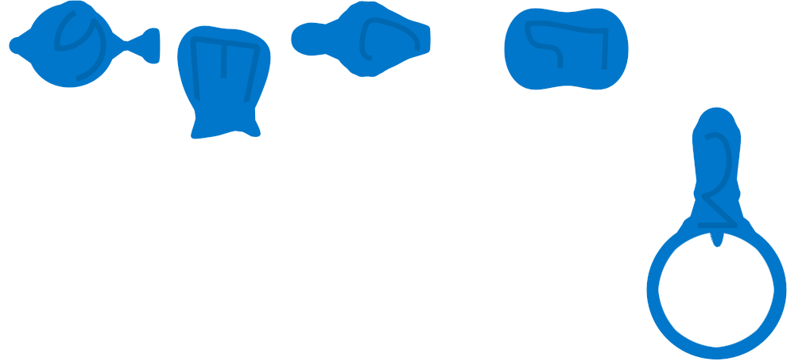

# Bloom: a cozy co-op garden for Board

*Working title. Design doc, draft 2, 2026-09-27. Nothing is built yet. How to build it: [BUILD.md](BUILD.md).*

Plant in spring, tend in summer, harvest in fall, and spend the harvest in winter on a bigger garden. It's played around the Board with the Mushka pieces, by one person or the whole family at once, and nothing ever dies.

## Contents

1. [The pitch](#1-the-pitch)
2. [Pillars](#2-pillars)
3. [The pieces](#3-the-pieces)
4. [The year](#4-the-year)
5. [The yard](#5-the-yard)
6. [Plants](#6-plants)
7. [Critters](#7-critters)
8. [Tools and hands](#8-tools-and-hands)
9. [Playing together](#9-playing-together)
10. [Winter and progression](#10-winter-and-progression)
11. [Around a session](#11-around-a-session)
12. [Look, animation and sound](#12-look-animation-and-sound)
13. [Walkthroughs](#13-walkthroughs)
14. [Decisions](#14-decisions)
15. [Cut and later](#15-cut-and-later)
16. [Open questions](#16-open-questions)
17. [How this doc was made](#17-how-this-doc-was-made)
18. [Sources](#18-sources)

## 1. The pitch

From Zach's wife, Sep 27, 2026:

- **Three seasons:** plant in the spring, grow in the summer, harvest in the fall.
- **Winter:** spend your money on more seeds, pots, land and equipment for next year. That's the main way the game gets more complex: you start with simple seeds and buy more complicated stuff.
- **Really good animations of things growing.**
- **The Mushka piece set:** a watering can, a sponge, a magnifying glass and a bag.
- **Tending:**
  - Water the plants.
  - Plants grow in different places. Too much sun and they dry out, so you water them. Too little sun and you might shade them or move them, or dig a mound, but that can't be unlimited.
  - Aphids: wash them off with the sponge. Pollinators are good and aphids are bad, so you have to tell the good insects from the bad ones by looking.
  - The bag harvests.
- **Tone:** not competitive. Cozy and co-op, multi-touch, lots going on at once. A garden that constantly needs tending. One person can play, or several can work together; with more people you plant more, and there's more to do. **Your own ability to multitask is the natural limit:** how much you plant sets how many tasks are live at once.

Zach's design lens, which every section below answers to: *"Good fun is a simple design, executed well, that engenders complex interactions."* Prefer tuning or cutting to adding.

## 2. Pillars

1. **Nothing dies, nobody loses.** Care decides *how much* you harvest, never *whether*. No fail screen, no countdown, no score that compares players, and no mistake a child can make by smashing the glass that can't be undone.
2. **Your attention is the difficulty.** Every plant makes work at a fixed rate. The family decides how much garden it can tend; the game never asks how many people are playing.
3. **The garden grows with the family.** After the first year, each year brings **at most three new things, counting everything:** crops, gear, critters and rough weather. A tool's new job comes with the thing that needs it (the trowel with lettuce, the magnifier's tags with ladybugs), and a look-alike pair or the two rough-day cards count as one.
4. **Real tools, shared.** One watering can, one sponge, one bag, one magnifier, and later one hose. Fingers do everything else, a little slower. "Pass me the sponge!" is the co-op.
5. **Growth is the show.** Every plant grows continuously, leaf by leaf; every touch gets a visible, audible response; and every fall the game stops to replay the year.

## 3. The pieces

Board is a 24" tabletop touchscreen that recognizes physical pieces. Players sit on **all four sides**, so nothing on screen may depend on which way is up. Input has real lag: slides, holds, lift-and-place and slow rotation work well; quick taps, twists and flicks don't ([Board's piece guide](https://docs.dev.board.fun/guides/piece-interaction-design)). BUILD.md has the hardware details.

Mushka is Board's gentle pet game, a "dog-moose" you wash, dry and put to bed. Its box has **one of each** of five pieces, and Bloom gives each a garden job. The piece-set model downloads without a login; BUILD.md has the commands.



| glyphId | SDK name | In Mushka | In Bloom | Arrives |
|---|---|---|---|---|
| 0 | Watering Can | washes Mushka | **Watering can**: pours where the spout points | year 1 |
| 1 | Goodie Bag | toy bag | **Harvest bag**: sweeps up ripe fruit in fall | year 1 |
| 3 | Scrubby Brush | scrub brush | **Sponge**: washes aphids off, carefully | year 1 |
| 4 | Wand | bubble wand | **Magnifying glass**: look through the hollow ring (about 40 mm across) to tell bugs apart | works from year 1; the guide introduces it in year 2 |
| 2 | Nozzle | hair dryer | **Garden hose**: wide, blunt, and it scatters good bugs too | bought, year 5 |

Until the hose is bought, the nozzle stays in the box. If someone sets it down anyway, it sprays a harmless rainbow mist.

## 4. The year

A year takes **about 9 minutes the first time and about 14 minutes later**, so a 25–30 minute sitting plays two years.

| Season | Length | Ends when | What you do |
|---|---|---|---|
| Spring | untimed, 1.5–3 min | someone **holds the sun** | plant, move pots, dig |
| Summer | **6 days of 72 s** (7.2 min); the first year has 4 days of 62 s | by itself after the last night | tend |
| Fall | untimed, 1.5–2 min | the last fruit is picked, then the year replays | harvest, the year in bloom |
| Winter | untimed, 1.5–4 min | someone **holds the sun** | shop, then place what you bought |

### Holding the sun

The sun sits on the sundial in the middle of the yard. It's the one "we're done" gesture, so a 5-year-old can't use it by accident:

- **It only listens while it pulses.** In spring it pulses once every spot is planted or 30 s have passed since the last planting; in winter, once the wheelbarrow hasn't changed for 10 s. At other times, and always in summer and fall, a finger just makes it wink and spin.
- **The hold:** one finger, still, for 1.5 s while a ring fills. It doesn't count if another finger is within 60 px or a piece within 150 px (a resting palm, the bag, the coin jar).
- **It can be undone.** A completed hold starts a 5 s sunrise; dragging the sun back down into the dial cancels it.

### A summer day

Each day is **60 s of daylight, 2 s of dusk, 8 s of night and 2 s of dawn** (the first year: 50 s of daylight). The sun crosses from one short end of the table to the other and the shadows sweep across the garden; that sweep is the clock. Pips on the sundial count the days. There are no numbers on screen.

- **Daylight** is the work.
- **Night** is the guaranteed breather. Needs freeze, fireflies come out, flowers close, beans fold their leaves, and the garden keeps growing in a quiet time-lapse.
- **Dawn dew** tops every plant up to 60% water, so one bad day never snowballs into the next.

### Weather: a director, not dice

From year 4, each summer deals **six of eight day cards**. The **director** picks which, one per dawn, from the **backlog**: how much of the garden spent yesterday wilting. A struggling garden gets a calm card; a coasting one gets a spike.

- **Before the spikes arrive** (years 2–3), the deck is the six calm cards and the director only picks their order, so a struggling garden gets its Rain Mornings first.
- **The first year's four days are scripted:** Sunny, Sunny, then a Rain Morning if more than 15% of the garden wilted on day 2 or a Bloom Day if not, then Sunny.

| Card | Kind | What it does | From |
|---|---|---|---|
| Sunny ×3 | calm | nothing special | year 1 |
| Rain Morning ×2 | calm | 20 s of rain waters everything and shrinks every aphid cluster | year 1 (scripted), year 2 |
| Bloom Day | calm | twice the bees and butterflies; no new pests. It asks for care, not speed | year 1 (scripted), year 2 |
| Heat Wave | spike | everything drinks faster (×0.6), so shade and hollows matter | year 4 |
| Aphid March | spike | a wave of winged aphids drifts in from one edge, a different edge each time | year 4 |

Day 1 is always Sunny, spikes never come back to back, and the last day is never a Heat Wave. Within a summer the day cards are the only thing that changes the rates (Gentle pace, section 11, is a setting the family picks); the director only chooses when they come. From year 4, a solo player who over-planted gets rain, and a coasting family of four gets a heat wave.

## 5. The yard

The screen is a backyard seen from straight above. During play the camera never moves or zooms: the pieces are a fixed physical size, so the plants must be too, and at a round table nobody owns the camera. The fall replay, when no hands are on the glass, is the one exception.

```
+-----------------------------------------------------------------------+
| ~ ~ ~ ~ ~ ~ ~ ~ ~ ~ ~ ~ ~   the creek, all the way round   ~ ~ ~ ~ ~ ~ |
| ~  old tree      [lot]      [ starter bed A ]      [lot]     meadow  ~ |
| ~  (shade)                                                           ~ |
| ~ [pots]   [lot]           ( sundial + spigot )           [lot] [pots]~ |
| ~                                                                    ~ |
| ~  meadow        [lot]      [ starter bed B ]      [lot]             ~ |
| ~ ~ ~ ~ ~ ~ ~ ~ ~ ~ ~ ~ ~ ~ ~ ~ ~ ~ ~ ~ ~ ~ ~ ~ ~ ~ ~ ~ ~ ~ ~ ~ ~ ~ ~ ~ |
+-----------------------------------------------------------------------+
```

- **The sundial** sits in the middle: the season clock, the sun to hold, the hose's spigot once you buy one, and the harvest basket beside it in fall.
- **Two starter beds** of 6 spots sit one on each long side, halfway to the creek, with a pot at each short end. Every seat has plants within reach from the first minute, and each bed has a nearest edge for demonstrations to face.
- **Buying land** peels a meadow **lot** back to soil: 6 more lots of 6 spots, and the patios hold up to 10 pots. That's **58 spots at most**. The yard filling in *is* the progress bar.
- **The meadow** is everything not yet dug: long grass that critters cross from every side. Only unplanted spots in owned beds grow wildflowers.
- **The creek** runs round the whole edge, within reach of every seat:
  - In spring, one packet per crop you own floats slowly round it, and pauses when a finger comes within 80 px. Drag from a packet to plant a copy.
  - In summer, fingers dip into it to carry a droplet of water.
  - In fall, the loaded harvest cart floats a lap so every seat sees it.
  - In winter it freezes, and the shop's cards sit on the ice.
- **An old tree** in one corner shades the lots near it; lettuce is happy there.
- **Spots** sit on a hex lattice 140 px apart (about 39 mm, three fingertips), jittered and rotated so it never looks like a grid. The lattice only shows while you're holding a seed, a pot or the trowel, tinted by how much sun a low plant would get there.

## 6. Plants

### Needs: water, pests and dead leaves

A plant has three kinds of need. An unmet need makes the plant **wilt**, and a wilting plant earns no care until the need is met.

- **Water** runs low. A thirsty plant wilts when its water reaches 10: in full sun, about 17 s after turning thirsty for Low thirst, 11 s for Medium and 7 s for High.
- **A pest** lands on it (section 7), or **a dead leaf** appears (about one every 2 days, and about every 20 s while the plant is wilting). Either one wilts the plant after a **10 s grace** (15 s in the first year), until someone removes it.

Light is different: it's a matter of *where* the plant is, fixed by moving things rather than by a quick task.

**Water** is a level from 0 to 100, read off the plant, never off a bar.

| Water | What you see | Effect |
|---|---|---|
| 30–100 | leaves up and glossy, dark soil ring | fine |
| 10–30, **thirsty** | leaves droop and dull; the soil ring pales, cracks, and gently pulses | the need |
| 0–10, **wilting** | flat droop, curled edges, a sigh and one falling leaf | counts against care |

- **Time from full to thirsty in full sun:** Low-thirst plants 60 s, Medium 40 s, High 25 s. From thirsty to wilting takes about a third of that again (the drop from 30 to 10).
- **Modifiers:** part shade ×1.4 longer, shade ×2, under the pumpkin canopy ×1.6, pot ×0.7 (dries faster), mound ×0.75, hollow ×1.6, Heat Wave ×0.6.
- **Watering a full plant does nothing.** There's no overwatering; enthusiasm is never punished.

### Light

Each plant wants Full, Part or Shade (radish takes anything). At dawn the game samples the sun's path twelve times and checks each plant's **top**: a shadow only counts if whatever casts it is taller than the plant. A plant lit for at least 70% of the day gets **Full**, 35–70% **Part**, less **Shade**. The shadows players watch are drawn from the same model, so the rule is exactly what they see.

- **Matched:** full value.
- **One step too dark:** the plant goes leggy and leans toward the sun: ×0.7.
- **Two steps too dark:** pale and small: ×0.4.
- **Too bright** for a Part or Shade plant: scorched leaf edges, and it drinks faster (×0.7). Lettuce in full sun for 2 days **bolts**.

### Height and shade

Every plant has a height: **Ground** (unstaked tomato, unsupported bean), **Low** (radish, lettuce, the pumpkin canopy), **Mid** (staked tomato), **Tall** (sunflower, corn, climbing bean). A mound adds one step; a hollow takes one away.

**The pumpkin canopy smothers** any Low or Ground plant on a spot it covers: that plant's light counts ×0.4, whatever light it wants, even a radish or a shade-lover. Mid and Tall plants stand above it and only get its water (×1.6).

**Shade is grown, not placed.** Plant a sunflower on the sun side of the lettuce. The tree, the pumpkin canopy, and pots you can drag are the other levers.

### Fixing light: pots, transplanting, mounds

Anything that changes the ground needs **the trowel**: hold a finger still for 600 ms until a trowel appears, then drag. That keeps it deliberate, so a mashing 5-year-old can't rearrange the garden.

- **Pots** move any time with an ordinary hold-and-drag.
- **Transplant a young plant** (before it buds): trowel it to an empty spot. It droops for 10 s from the shock and loses a little lushness, never fruit. After budding, only pots move.
- **Dig a mound:** trowel soil from an empty spot onto a neighbouring spot, planted or not. The first becomes a **hollow**, the second a **mound**. **Soil is conserved**: that's the pitch's "can't be unlimited", with no counter.
  - **Mound:** one height step taller, so its plant rises out of shade and casts more; dries faster. Real squash hills are this.
  - **Hollow:** one step lower, and it holds water.
  - Trowel the soil back to undo. Mounds and hollows last between years.

### Growing and harvest

- **Every plant reaches harvest.** Growth follows the calendar, from seed in spring to ripe at the first fall dawn. Care, light and bees decide how *good* the plant gets, shown as size and lushness.
- **A seed hatches the first time it's watered:** the soil bulges and cracks and two seed leaves open like a book. An unwatered seed still sprouts at dawn.
- **Care:** each day a plant scores the fraction of daylight it spent *not* wilting. Its summer care **C** is the average.
- **Quality:** `Q = (0.4 + 0.6 × C) × light × pollination`. A plant is worth **maxFruit × price × Q**, shown as fruit size (a Q of 0.5 means half-size fruit). The cart rounds its total to whole coins.
  - Total neglect still earns 40%.
  - A plant that never had a bad day (every day's score at least 0.9) grows one of its fruit **golden**. It pays the same coins as the rest and earns a decoration pick in winter (section 10). The bag won't take golden fruit: it has to be carried to the basket by hand.
- **Frost:** at the end of fall each annual goes to seed and folds down under the snow to sleep. The game never says or shows "die".

### Pollination

- Flowering crops open flowers on set days (see the roster). **One bee landing sets a flower;** you watch it swell. Unvisited, it shrivels and drops.
- `pollination = max(share of flowers visited, 0.5)`. A plant nobody pollinated still gives half.
- **Sunflower heads fill in seed by seed as bees visit**, so bees make fruit from the very first year.
- **Corn** is wind-pollinated instead: its pollination is its number of corn neighbours ÷ 2 (at most 1, at least 0.5).
- **Crops with no flowers** (radish, bean) take pollination 1.

### Pruning: the pluck

Hold a dead leaf and it snips off. Healthy leaves, flowers and unripe fruit just wobble and spring back, so small hands can't do damage. Pumpkin vine tips are v1's other pluck target (year 4): hold a tip to pinch it, and that vine stops creeping. Later content adds strawberry runners and mint. Pruning is fingers-only on purpose, since tools are scarce and the pluck gives every free hand a job.

### The v1 roster

Seven crops, each adding one twist. "Later" crops are ranked in [section 15](#15-cut-and-later).

| Plant | Year | Height | Light / thirst | The one twist | Flowers on (summer day) | Worth (maxFruit × price) |
|---|---|---|---|---|---|---|
| Radish | 1 | Low | any / Low | forgiving: grows anywhere | — | 3 × 2 |
| Sunflower | 1 | Tall | Full / Med | tall and a bee magnet; its head fills as bees visit | 3–5 (3–4 in the first year) | 1 × 8 |
| Lettuce | 2 | Low | Shade or Part / Med | wants shade; bolts after 2 days of full sun (worth a fifth, but its flowers feed bees on days 4–6) | if bolted | 1 × 6 |
| Tomato | 2 | Mid staked, Ground unstaked | Full / Med | flops without a stake, and then everything shades it | 2–5, one a day | 6 × 2 |
| Pole bean | 3 | Tall if climbing, Ground if not | Full / Med | climbs a trellis *or a tall neighbour* | — | 6 × 2 |
| Pumpkin | 4 | Low canopy | Full or Part / High | its vine covers the ring of spots around it and creeps one more spot a day until pinched; one pumpkin per 3 spots covered. Pinch every tip early for one giant instead (worth 50) | mornings of 4–5 | per 3 spots × 20 |
| Corn | 5 | Tall | Full / High | wind-pollinated: needs corn neighbours | — | 2 × 5 |

These values are starting points; bot sweeps set the final numbers ([BUILD.md](BUILD.md)).

### What emerges

1. **Lettuce under a sunflower:** tall shade makes a shade-lover happy in a sunny bed and stops it bolting.
2. **Flowers feed fruit:** sunflowers and bolted lettuce bring the bees that set tomatoes and pumpkins.
3. **Living trellis:** beans climb a sunflower or corn instead of a bought trellis, and the pair casts a double shadow.
4. **The Three Sisters, from three unrelated rules:** corn needs a block of corn, beans need something tall, and the pumpkin canopy keeps the ground wet while smothering only low plants, so corn and beans stand above it. Pumpkin takes Part light, so it's happy underneath.
5. **The canopy cuts both ways:** it smothers radish and lettuce but keeps tomatoes and corn watered. Pinching vine tips decides who's under it.
6. **A mound lifts a plant out of shade:** a tomato on a mound clears the sunflower's shadow; a sunflower on a mound towers over everything.
7. **Neglect cascades:** thirst brings dead leaves, and dead leaves are one more need. Players naturally cover each other's corners.
8. **Staking changes shade:** a staked tomato shades the lettuce behind it; unstaked, it flops and gets shaded.
9. **Bolted lettuce** is a failed crop and a bee flower at once.

## 7. Critters

### Rules

1. **Nothing dies.** Pests get washed off, picked off and tossed over the hedge, or shooed. Friends fly off.
2. **A pest on a plant is a need**, like thirst. There's no separate damage meter.
3. **No markers on bugs.** Telling good from bad *is* the skill. Good and bad are never colour-coded.
4. **The tells stack:** look, then motion, then context (which plant, what it's doing), then the magnifier.
5. **One new discrimination at a time.** Critter sizes never change, so what players learned stays true.
6. **Knocking off a friend costs something you can see:** the flower it was on drops.

**The motion rule, readable from any seat:** friends *fly between flowers* (a shadow apart from the body, arcing paths, warm colours). Pests *cling to leaves* (an attached shadow, dull colours, visible damage). Sound backs it up: bees hum low, wasps whine high, a hovering hoverfly goes silent. Critters are drawn at storybook scale, about 1.8× life, so the far seat can see them.

### The v1 critters

| Critter | Friend or pest | Year | Size | How to tell | What it does | How to remove | If ignored / if wrongly removed |
|---|---|---|---|---|---|---|---|
| **Aphids** | pest | 1 | 14 px each, clusters 60–100 px | lime clusters on stems that jiggle in place; leaves curl | clusters grow small → medium → large; a large one sends a winged aphid to the nearest clean plant | sponge; a finger's rub; hose | plant wilts, aphids spread |
| **Bee** | friend | 1 | 50 px | round, fuzzy, yellow and black; bumbles in loops; low hum | lands on open flowers and pollinates them | — | that flower drops |
| **Ladybug** | friend | 2 | 40 px | red dome; crawls straight to aphids | eats an aphid every 1.5 s | — | flies off, and your free pest control goes with it |
| **Hoverfly** | friend | 3 | 44 px | yellow-black stripes; **hovers dead still, then darts**; one pair of wings | pollinates; its larvae eat aphid clusters | — | lose its help |
| **Wasp** | pest | 3 | 44 px | yellow-black stripes; **jittery zig-zag**; a pinched waist | lands on flowering plants and chases the bees off | a finger when it's landed; hose | wilt and missed pollination |

The ladder: year 1, aphids vs bees, where everything differs; year 2, a friend *inside* the pest cluster; year 3, true look-alikes that only motion, context or the magnifier split. Later content continues it (section 15).

### Where critters come from

- **Pests have their own clock.** Each plant draws a pest on average every **180 s** of daylight in year 1, **135 s** in year 2 and **105 s** from year 3 (±30%), picked from the pests that plant can host.
- **Aphid clusters grow** every 20 s (every 14 s in a Heat Wave). They spread only in daylight, never overnight. Rain shrinks every cluster one size.
- **Bees** on screen ≈ open flowers ÷ 5, where a sunflower or a wildflower spot counts as 2–3 flowers.
- **Wild ladybugs and hoverflies live in the wildflowers.** They come from the nearest wildflower spot 15 s after a cluster reaches medium, at most 1 per 8 plants; with no wildflower spots, after 30 s.
- **Sparing a friend is loud:** a bee that finishes its visit next to your sponge does a happy loop, and the flower swells with a chime.

### Helpers

In v1 there's one: the **ladybug jar** (bought each winter, from year 5): 3 ladybugs live in the garden all summer. Less work, and more friends in the sponge's way. More helpers are later content.

## 8. Tools and hands

### Principles

1. **Tools belong to the garden, not to players.** Crossed hands and swapped pieces never matter, and the game never needs to know who did what.
2. **Four piece gestures:** slide, rest, slow rotation, lift-and-place. No twist, flick or shake. Every action needs a short hold (200–300 ms) to start.
3. **Effects land beyond the piece,** because the piece hides what's under it.
4. **Pieces are scarce, fingers are unlimited.** Fingers can do every tool's job, just slower, so nobody waits for a piece.
5. **A parked piece is polite:** a piece resting with no hand on it for 3 s makes the plants under it rustle and chirp "excuse me".

### The pieces

**Watering can.** Park it with a hand on it and it pours; take your hand off and it stops. Water arcs from the spout and lands about 160 px away, so **rotate it slowly** to sweep the stream across neighbours. It fills a thirsty plant in about 1.5 s and never runs dry (Board's guide: tool pieces keep no charge). If the piece can't sense the hand, it pours whenever it's parked over a thirsty plant instead.

**Sponge (the Scrubby Brush).** Scrub over an aphid cluster. The game measures **how far the sponge travels** over the cluster: about 250 px of scrubbing removes one layer, so a cluster takes 1–3 s of relaxed scrubbing. Suds foam along the stroke.
- **Go slow near friends.** A landed bee or ladybug lifts off and hovers when the sponge approaches slowly (under 150 px/s), then settles back. A fast scrub catches it: the friend flies off quietly on one low note, and the flower it was on drops.

**Harvest bag.** Fall only. Slide it over a plant and its ripe fruit flies in and **orbits the bag**, up to 10, so what's inside is always visible. Rest it on the basket by the sundial for half a second and the load cascades in. Golden fruit stays put for a hand to carry.

**Magnifying glass (the Wand).** Look through the hollow ring.
- **Inside the ring**, critters are drawn 2× bigger with their tells showing (faces, wings, a waist, spots), while the garden stays life-size, so input lag never looks like a misaligned picture.
- **Hold still to focus:** after 250 ms still, the blur snaps sharp with a tick. Real loupes need focusing, so the input lag reads as physics.
- **Tag:** a critter kept in focus for 400 ms gets a tag for life: a gold ring with a heart for friends, a slowly turning coral dashed ring for pests. Different shapes, so it's colour-blind safe. The holder becomes the table's spotter and calls the sponge over.
- **Over a plant** it shows picture icons for its water, its light and its fruit.
- **In the shop**, over a card, a 3-second demo of the item plays inside the ring.
- **Facing the holder:** the handle points at whoever holds it, so the lens's picture card sits on the far side of the ring, upright for the holder from any seat.

**Garden hose (the Nozzle).** Bought in year 5. It runs from the sundial's spigot on a line of about 300 px, so it covers the middle of the yard and the can keeps the ends. Park it with a hand on it and it sprays a 40° cone 280 px long; rotate to aim.
- It **waters the whole cone** at the can's rate and **blasts aphid clusters** down a size every 0.8 s (a real organic remedy).
- It's indiscriminate: every flyer in the cone scatters for 15 s, and a blossom held in the spray for 3 s drops. Crawlers, like ladybugs, hold on.
- The hose is broad and blunt, the sponge slow and precise: choosing between them *is* the good-bug/bad-bug skill.

### Fingers

| Verb | How | Uses |
|---|---|---|
| **Hold** | still for 250 ms on a thing | pick a crawling pest off (it arcs over the hedge); shoo a landed wasp; snip a dead leaf; pick one fruit in fall |
| **Hold, then drag** | hold 250 ms, then drag slowly | plant from a creek packet; move a pot; carry a water droplet from the creek (+25 water); drag shop cards |
| **Rub** | rub back and forth over an aphid cluster | washes it at a third of the sponge's rate |
| **Trowel** | hold 600 ms until the trowel appears, then drag | dig a mound; transplant a young plant |
| **Hold the sun** | see section 4 | end spring or winter |

Every critter has a 50 px hit radius and the nearest one wins; holding a friend by mistake only shoos it. Flyers dodge any finger within 40 px, so stray hands never hit a bee. There are no taps (unreliable on Board) and no pinch (with hands close together, the game can't tell whose fingers go together).

## 9. Playing together

- **Everything is shared:** one garden, one coin jar, no player identity, no per-player stats or colours.
- **No fights by construction:** every action is safe to repeat. Two people watering one plant just fill it faster. Picked fruit is simply gone.
- **Roles emerge; nobody assigns them.** The starter beds sit on both long sides and needs spawn all over, so every tool has work on every side, and "pass me the sponge!" happens on its own. Jobs tier themselves: the youngest carry droplets, rub aphids, and carry the golden fruit; older kids take the can and sponge; an adult runs the magnifier and the layout.
- **The garden scales itself** without asking how many are playing (Board's roster is a poor headcount; families won't register every kid who wanders up):
  1. **Land caps it:** you can't plant more than you own.
  2. **Unplanted spots grow wildflowers,** home to the ladybugs and hoverflies, so leaving spots empty buys less pest work.
  3. **The director** sends calm days to a struggling garden and, from year 4, spikes to a coasting one.
  4. **The honest trade:** more plants always earn more coins, but an over-planted garden wilts, its music thins, and it grows no golden fruit. The family decides what feels good.
- **What counts as a task:** one gesture that meets at least one need. A can sweep over three plants is one task.
- **Tuning target:** about **3 tasks per player per minute** in year 1, rising to about **6** at the year-4 peak, which is the year with the most *kinds* of task, not the fastest pace. Players aren't equal: bots test a mixed family (see BUILD.md), not four identical adults.
- **Orientation:** everything is drawn from above; icons are round and read at any rotation; the sundial is the clock; demonstrations face the nearest edge. Coin counts print four times facing outward and never carry meaning alone.
- **Kids (assume 5–10):**
  - **No reading required.** A translucent **ghost hand** demonstrates each gesture right beside the thing that needs it; a guide critter chirps happily or sadly.
  - **Sound first:** every need and every action has a sound, because players' eyes are on their hands.
  - **Safe hands:** healthy plants spring back, ground changes need the trowel, and the sun can be dragged back down.

## 10. Winter and progression

### Four rules carry it

1. **The yard is the progress bar.** Everything is on screen from year 1; buying land turns meadow into beds. Land is never a shop card: the next lot is always for sale.
2. **Cards arrive by year and by problem.** Every card has an **earliest year**. Seeds and the hose arrive at theirs. Other gear waits until the garden has shown the problem it solves (a plant sulking in the wrong light brings pots; a tomato flopping brings stakes), then arrives the next winter. Each winter brings **at most three new things** as pillar 3 counts them, critters and weather included; when more are due, the earliest year goes first and the rest wait a winter. At most one new piece comes out of the box.
3. **The sawtooth.** New crops and critters push the variety of work up to year 4. Then the hose waters a whole cone per gesture and the ladybug jar thins the aphids, and the family spends the attention it gets back on more plants.
4. **No debt, no upkeep.** Buying a seed card unlocks that crop for good; you plant as many as you have spots. A bad year only means buying things a little later.

### What stays manual forever

- **Harvesting with the bag.** It's the payoff.
- **Telling good bugs from bad.** Automation makes it *bigger*: the hose scatters friends, and ladybugs walk into the sponge's path.
- **Where things grow** relative to the sun, and **planting.**
- **Watering the ends of the yard,** beyond the hose.

### The year arc (v1)

| Year | New this year | Pieces | Plants (2 players) |
|---|---|---|---|
| 1 | the tutorial, one thing a day: water, aphids, bees, dead leaves, then the harvest | can, sponge, bag (magnifier works) | 8–14 |
| 2 | lettuce and light (shade it, or trowel it a mound) · tomato, which flops · ladybugs, and the magnifier's tags | + magnifier introduced | about 16 |
| 3 | stakes · pole bean · hoverfly vs wasp | | about 20 |
| 4 | pumpkin · the rough days (Heat Wave, Aphid March) · trellis, if a bean had nothing to climb | | about 24, **the peak** |
| 5 | **garden hose** · corn · ladybug jar | + hose | about 28, **the relief** |
| 6+ | later content, up to three things a year, in the order in section 15 | | growing to 58 |

At about two years a sitting, v1's five years take about three sittings (about 65 minutes of play) before later content takes over.

### Catalog (v1)

| Item | Kind | Price | Earliest year | Arrives when | The one thing it adds |
|---|---|---|---|---|---|
| Radish, sunflower | seeds | — | 1 | start | the basics |
| Lettuce | seed | 5 | 2 | year 2 | shade-lover; bolts |
| Tomato | seed | 10 | 2 | year 2 | flops without a stake |
| Clay pot | pot | 8 | 2 | a plant sulks in the wrong light | more pots (the starter pots already move), so not a new thing; stands on a patio or a bed spot, never the meadow |
| Stake | gear | 3 | 3 | a tomato flops | drag from the plant to tie it up; reusable |
| Pole bean | seed | 10 | 3 | year 3 | climbs |
| Pumpkin | seed | 20 | 4 | year 4 | sprawls; one-morning flowers |
| Trellis | gear | 10 | 4 | a bean has nothing to climb | something tall that casts no shade |
| Garden hose | gear | 120 | 5 | year 5 | the Nozzle joins |
| Corn | seed | 15 | 5 | year 5 | wind-pollinated block |
| Ladybug jar | helper | 15 per year | 5 | 100 aphids washed | 3 ladybugs all summer |
| Garden bed | land | 25, 40, 60, 80, 100, 130 | 1 | always for sale | 6 spots on a meadow lot you choose; near the tree is shady |

**Prices are fixed**, so kids learn what things are worth, and coins roll over, so saving up for the hose is a real goal. **Rough income** at decent care (C = 0.8, light matched): about 5–6 coins a plant, so about 45 for a solo first year of 8 plants and about 80 for a family's 14. The first winter's lettuce, tomato and next bed cost 40. Bot sweeps set the rest of the curve (BUILD.md).

### The winter shop (1.5–4 minutes)

1. **Tally.** The harvest cart's coins pour into the shared **coin jar** in the middle of the table.
2. **The mail.** Up to three new things arrive, plus a piece to take out of the box if one is due ("the hose came!").
3. **Shop.** Cards sit on the frozen creek, each facing its nearest side. A price shows as a coin stack plus a numeral, for kids who can't read yet.
   - Hold the **magnifier** over a card to watch a 3-second demo inside the ring.
   - **Anyone can drag cards into the wheelbarrow.** A card dragged back out goes onto the jar's lid as a **wish**, with a progress ring showing how close the jar is. "No" becomes "let's save for it".
   - Nothing is final until someone holds the sun, and even then the sunrise can be dragged back. The negotiating happens out loud, which is where the co-op lives.
4. **Decorations aren't bought.** Each golden fruit from the harvest earns one decoration pick (a gnome, a bird bath, lights), and whoever wants it places it. The kid gets a treat and the bed money stays put.
5. **Place.** Drag new beds onto meadow lots (a bed can move to another lot in any winter) and gear into the garden. After four minutes the snow starts to melt and spring music fades in: a nudge, never a timer.

### Goals that aren't money

- **Golden fruit**, and the decorations they earn.
- **The collection book:** a page per crop with two stickers, grown and golden. It opens from the title screen and in winter.
- **The year in bloom and the album:** every fall replays the year (section 12), and each year's replay is kept in the album.

## 11. Around a session

### The garden gate (title screen)

- **Each garden is a picture:** its latest album frame, with an icon name, so nobody needs to read. Hold a picture for 1 s to open that garden. "New garden" is a seed packet lying on the gate.
- **Saves belong to players** on Board, and opening a garden sets the session's players to that garden's. So on first launch the game suggests one family garden, plus a separate garden for anyone playing alone ("Mom's garden"), so a solo evening never spends the family's coins.
- Autosave runs at the start of every season and every summer dawn, so quitting loses at most one day.

### Setting the table

At the start of every session, outlines of this garden's pieces appear on the creek, one per side. Setting each piece on its outline plays its hello sound. That confirms the Board sees it, shows everyone which pieces are live, and spreads the tools round the table. Pieces the garden hasn't unlocked show a closed box.

### Welcome back, and new players

- **Opening a garden** shows last year's album frame, then dissolves into the garden.
- **The first use of each tool in a session** replays its ghost demo once.
- **Rest any piece on the sundial** to see its demo: a "how does this work?" that needs no reading, for Grandma sitting down in year 5.
- **First sightings:** the first time any new crop twist, critter or weather card appears in a garden, time slows to quarter speed for 3 s, the guide critter flies to it and chirps happily or sadly, and a new tool gets its ghost demo. At most one per day; the rest wait. It's the first year's script, applied to every year.

### The pause menu

Board supplies Resume and Exit. Bloom adds:

- sliders for music, garden sounds, and effects;
- **Show me how**, which replays the ghost demos;
- **Missing piece**, which gives a finger-driven copy of a lost piece (off by default: always-available copies would end the passing);
- **Gentle pace**, which slows every need by a third, for quiet evenings or anyone who wants it. It never asks for a headcount.

## 12. Look, animation and sound

### The look

**A storybook garden seen from straight above**, rendered at full 1080p with soft, flat-shaded procedural plants that have real height. Something is always moving.

- **Camera:** straight down, a narrow 12° perspective, never panning or zooming during play. Tall plants lean gently outward from the centre and read a little bigger, so plants rise toward every seat equally. A 3/4 view was rejected: two seats would see everything upside down.
- **Height reads as shadow.** Soft shadows fall along the sun's direction, long at dawn and dusk, short at noon, from the same shadow model the light rule uses.
- **Why not the pixel look of Pool Panic and Flying Hamsters?** At 480×270 a radish leaf is about 5 pixels, too small to animate growth. The deterministic approach carries over; the resolution doesn't.
- **Everything is procedural,** so no artist is needed. Plants are assembled from leaf, petal, stem and fruit parts, and **a new species is data:** about 20 numbers for leaf arrangement and outline, sizes, colour ramps, height, flex, flowers, fruit, and flags such as sun-tracking, night-folding, sprawl and bolting. BUILD.md has the rendering plan.

### Growth animation

- **Nothing pops.** The drawn plant follows the sim through a damped spring.
- **Organs grow one at a time, staggered** in golden-angle order, so every plant always has two or three leaves or petals mid-unfurl.
  - **Leaves** lengthen with a little overshoot, emerge slim then fatten, and flatten from folded to open.
  - **Flowers:** the bud swells, the sepals split, and petals open one by one, 40 ms apart. They close partway at night.
  - **Fruit** sets as a bead, swells, and walks its colour ramp (tomato: green, yellow, orange, red) as it gains gloss. Ripe fruit pops to 1.08× and **glints** every few seconds, so ripeness never depends on colour alone.
  - **Germination:** the soil bulges and cracks, and the seed leaves open like a book.
- **Water shows in posture:** leaf angle follows the water level through a bouncy spring, so watering is a visible perk-up within 150 ms, and each droplet kicks the leaf. Dry plants droop in stages, tint olive and curl.
- **Light shows in shape:** shade makes plants leggy and pale, leaning toward the sun; too much sun bleaches the leaf edges.
- **Circadian motion:** sunflowers track the sun, beans fold their leaves at night, pumpkin flowers open at dawn and shut by noon.
- **Meeting a need gives a lushness burst:** 1.5 s of extra fullness with overshoot, rising sparkles, and a chime tuned to the species. A plant's **first bloom** opens in slow motion with a soft glow.
- **Harvest pop:** a squash, a pop, an arc into the bag, and the leaves spring up, relieved.
- **Wind:** one gust field rolls across the garden every ten seconds or so, a visible wave through every plant, and drives the wind sound too.

### The year in bloom

Nobody can watch the growth while they're busy tending it, so every fall stops to show it.

- **Fall opens with 5 s of stillness** before the harvest bell: the ripe garden sways and glints, and every plant plays its note.
- **After the last fruit is picked, the year replays** in 20 s, from bare soil to harvest, rebuilt from each plant's state at every dusk. The camera drops low and circles the table once, so every seat gets its side view of the sunflowers rising. (If the plant parts don't hold up from a low angle, the replay stays top-down.)
- The replay goes into the **album**, and plays from the garden gate.

| Plant | From above | Signature motion |
|---|---|---|
| Radish | five spoon leaves | fastest; magenta shoulder; a boing at harvest |
| Lettuce | ruffled rosette | the heart swells; bolts upward after two days of full sun |
| Sunflower | tallest; heart-leaf pairs; a Fibonacci head | tracks the sun; the head fills seed by seed as bees visit |
| Tomato | serrated bush | star flowers; flops when unstaked; fruit drawn above the leaves |
| Pole bean | three-pole teepee | vines climb inward and up; leaves sleep at night |
| Pumpkin | wandering vine with huge lobed leaves | creeps outward; the biggest swell |
| Corn | tall arching blades | tassels wave in every gust |

### Seasons and weather

| Season | Light | Ground | Signature |
|---|---|---|---|
| Spring | cool, soft shadows | fresh dark soil | mist, drifting blossom |
| Summer | warm, saturated, hard shadows | dries lighter and cracks | cicadas, cloud shadows, a bleached glare in heat waves |
| Fall | amber, long shadows | straw | leaves turn and blow |
| Winter | blue-white | snow | snow caps on stalks, poles and pots; fingers leave trails |

Night dims to about half with a blue tint, never too dark to read the bugs. Rain darkens the soil and the whole garden perks up at once. Season changes sweep outward from the centre, so no seat sees them "arrive" first.

### Tool effects

- **Can:** a ribbon of water arcs past the spout, shedding droplets that splash and ripple; the soil darkens where it lands.
- **Hose:** a mist cone with a faint rainbow.
- **Sponge:** iridescent suds along the stroke that pop after a second or two; washed leaves flash clean.
- **Magnifier:** a glass rim with a glint; the enlarged critters inside a soft-edged disc just inside the hole.
- **Bag:** ripe fruit detaches one piece at a time and arcs into the bag's mouth, each with a rising note.
- **Critter reactions:** bees veer from a slow sponge and settle back; ladybugs freeze; a knocked-off friend drops a puff of pollen and flies away on one low note; washed aphids tumble off as specks. No gore, and nothing funny about hurting a friend.

### Sound

- **Synthesized first,** like the sibling games. Kalimba, marimba, bells, pads and noise beds synthesize well; birdsong and rain are the risk. If they sound cheap, swap in free (CC0) recordings.
- **Ambience:** birds in spring, gust-driven wind, rain, cicadas and crickets in summer, a crackling fire in winter.
- **Tools:** a gurgling pour, a hose hiss, a squeaky scrub with bubble pops, a glassy shimmer and focus tick for the magnifier, a whoosh and plips for the bag.
- **The garden plays itself:** a slow sweep circles the garden once per bar, and each healthy plant it passes plays a note (the species picks the instrument, its stage the octave, its health the volume). The music thickens as the garden grows. A wilting plant's note dulls and drops out, so a thinning song warns of neglect even to players watching their hands.
- **Reward chimes snap to the beat and the scale,** so many rewards at once make a melody instead of noise. Tool sounds play instantly. No stereo cues: nobody shares a listening position round a table.

## 13. Walkthroughs

### The first year, minute by minute

The first year adds one thing a day, and that's a rule, not just a script: each need waits for its day. Aphids start on day 2, bees and wildflower blooms on day 3, and dead leaves on day 4.

| Time | Beat |
|---|---|
| 0:00 | The garden gate: "new garden" seed packet. Snow melts outward from the sundial: two starter beds, two pots, the creek flowing. The guide critter lands. |
| 0:10 | **Setting the table:** outlines of the can, sponge, bag and magnifier appear round the creek; each piece set down says hello. The nozzle's outline is a closed box. |
| 0:30 | Radish and sunflower packets float by. The ghost hand plants one: hold, drag, let go. Everyone plants; unplanted spots will grow wildflowers. |
| 1:30 | The sun pulses; someone holds it; a 5 s sunrise. |
| 1:35–2:25 | **Day 1: water.** The ghost hand pours on a seed, and it hatches. Every seed that's watered hatches on the spot. A finger can carry creek droplets too. |
| 2:27–2:35 | **Night 1:** the sprouts grow into leafy plants. |
| 2:37–3:27 | **Day 2: aphids** creep in from one edge. The sponge's outline glows; a finger can rub. |
| 3:39–4:29 | **Day 3: bees** come for the first sunflower flowers, and the heads start filling. If the family fell behind on day 2, it's a Rain Morning; otherwise a Bloom Day swarm. |
| 4:41–5:31 | **Day 4: dead leaves**, and everything together, the busiest stretch of the year and still gentle. |
| 5:33–5:43 | The last night: everything ripens. Autumn dawn. |
| 5:43–5:48 | 5 s of stillness, then the harvest bell. |
| 5:48–7:15 | **Fall.** The ghost hand shows the bag's sweep and dump. Kids pick with fingers and carry the golden fruit. |
| 7:15–7:45 | The cart floats a lap of the creek; **the year replays in bloom** (20 s); snow falls. |
| 7:45–9:15 | **Winter:** the coins pour into the jar; two cards (lettuce, tomato), the next bed, and a decoration for each golden fruit. Someone holds the sun. Year 2. |

### A mid-game summer (year 4)

Zach and two kids own 4 beds and 4 pots (28 spots). They planted 22 and left 6 as wildflowers. This summer's cards so far: Sunny, Aphid March from the north, Sunny.

**Day 4, the Heat Wave:**

- **0:00:** dawn dew; the sundial glows orange; the light bleaches.
- **0:05–0:20:** the south bed droops in a wave. Kid A sweeps the can along it while Kid B carries creek droplets to the pots at the ends. Zach drags two potted lettuces into the sunflower's shadow.
- **0:22:** yesterday's leftover aphids have spread to a tomato. Kid B shouts, and Kid A slides the sponge across the table: the pass.
- **0:30:** Zach sweeps the magnifier over the tomato flowers and tags a wasp among the hoverflies; Kid B shoos it with a finger.
- **0:45:** the pumpkin's vine creeps toward the radishes. Zach pinches the tip.
- **Night:** the pumpkins swell, and the tomato that sat wilted is visibly smaller than its neighbours: a cost you can see, with no fail state. They fell behind today, so the director deals **Rain Morning** for tomorrow: the planned exhale.

Day 6 (Bloom Day) asks for care rather than speed: slow sponges near the flowers. The summer's deck reads Sunny, Aphid March, Sunny, Heat Wave, Rain Morning, Bloom Day: six of eight, the spikes apart, and a calm last day.

## 14. Decisions

Seven component drafts and three critiques disagreed in places. This is how each was settled.

| Topic | Options | Decision | Why |
|---|---|---|---|
| Day length | 20 s days × 30; 72 s days × 6 | **72 s days, 6 per summer** | whole days are a unit kids feel; nights give a breather and a growth showcase |
| Harvest math | whole fruit, rounded up, at least 1; continuous value | **continuous: maxFruit × price × Q, shown as fruit size** | rounding made care worthless on single-fruit crops |
| Relief valves | dew, mercy shower, 40% floor, pollination floor | **keep dew and the floors; cut the mercy shower; deal 6 of 8 cards** | stacked together they made water nearly free; from year 4, a 6-of-8 deck gives the director a real choice |
| Golden fruit | worth 3×; a decoration pick | **a decoration pick, same coins** | at 3× it tripled one-fruit crops and made all-sunflower gardens the best play |
| Pests | a share of a "need stream"; their own clock | **their own clock** (180 / 135 / 105 s per plant) | the need stream was never defined |
| Task | one need met; one gesture | **one gesture** | it's what players feel, and it makes the hose a real relief |
| Can refills | a tank and a rain barrel; endless | **endless** | Board's guide: tool pieces keep no charge; a refill spot favours one seat |
| Pest markers | bubbles over every need; none on bugs | **no markers on bugs** | a bubble over pests but not friends gives the answer away |
| Knocking off a friend | a sad buzz; the flower drops | **the flower drops**, and no dizzy stars | a 5-year-old reads dizzy stars as a reward; a dropped flower is a cost you can see |
| Pollination | bonus; hard gate; gentle need | **gentle need** (floor of half), and sunflowers need bees from year 1 | bees matter from the first year without punishing anyone |
| Light rule | per spot; per plant | **per plant, from a shared shadow model** | mounds, stakes and canopies only work if height matters |
| Starter garden | one bed of 6 in the middle; two beds on the long sides | **two beds of 6 plus two pots** | four players need room and every seat needs plants within reach |
| Holding the sun | anyone, any time; all hands on the wagon | **only while it pulses, and undoable** | a 5-year-old ends spring early otherwise; all-hands needs a headcount |
| Seeds | counted, returned at harvest; a permanent unlock | **a permanent unlock** | seed counting never mattered, since every plant is harvested |
| Unlocks | harvest counters; earliest year plus problem | **earliest year; problems trigger gear only** | the counters didn't produce the year arc |
| Moving plants | pots only; transplanting young plants too | **both, behind the trowel** | the pitch treats moving and mounding as tending, not just planning |
| Hose | corner spigot, long upgrades; centre spigot, short line | **centre spigot, about 300 px** | a long hose retired the can and sponge; a corner favoured one seat |
| Overwatering | soft penalty; none | **none** | the hose's cost is the friends and blossoms it knocks off |
| Placed shade | umbrella; grown shade and pots | **grown shade and pots** | a sunflower in the right place is the interaction |
| Marigolds | repel aphids | **cut; nasturtium is later content** | marigold repellence is a myth; nasturtium trap crops are real |
| Birds | peck ripe fruit | **cut** | fruit ripens in fall, and fall has no pressure |
| Plant death | crispy after 2 dry days; never | **never**, and frost is "going to seed" | smaller harvests teach the same lesson |
| Scope | 12 crops, 10 critters, 26 items; a v1 core | **v1: 7 crops, 5 critters, 12 items**, and a ranked later list | ship the core, play it, then add what interacts most |
| Watching growth | nights only; a yearly replay | **nights plus the year in bloom** | tasks take everyone's eyes; the replay gives the show its own moment |
| Saves | the active profile; per garden | **per garden, with a garden gate** | Board ties saves to players; a solo evening mustn't spend the family's coins |
| Renderer | 480×270 pixels; full-res procedural | **full-res procedural** | growth is the show |

## 15. Cut and later

### Later content, best first

Each arrives the same way as v1 content: up to three new things a year.

1. **Dill** (brings ladybugs and hoverflies) and the **swallowtail caterpillar** on it: a friend later, since it becomes a butterfly that pollinates, versus the **cabbage worm** on radishes. The host plant decides keep or remove.
2. **Nasturtium**, a real aphid trap crop: winged and marching aphids land on the nearest nasturtium within two spots, so you wash them off in one place.
3. **Strawberry:** comes back every year; its runners root free plants.
4. **Row cover:** nothing lands on the covered lot, friends included, and the lot is one light step darker.
5. **Beehive:** 1.5× bees, and more bees to work around.
6. **Drip line:** a bed dries half as fast.
7. **Chili:** loves heat, the one plant that does *better* in a Heat Wave.
8. **Ladybug larva:** a spiky "tiny alligator" that looks scary and is a friend (gardeners really do squash these by mistake).
9. **Bean beetle:** a pest that looks like a ladybug.
10. **Slugs** after rain, and a **toad house** that eats them.
11. **Mint:** spreads unless it's potted.
12. Later still: a greenhouse, a giant-pumpkin record, year cards, and new yards with different sun maps.

### Cut

- **Plant death:** a smaller harvest teaches the same thing without upsetting a 5-year-old.
- **Visible timers and countdowns:** the sundial and the sweep of the sun are enough, and numbers read upside down.
- **Asking how many are playing:** the roster is unreliable, and the garden scales itself.
- **Per-player money, colours or scores:** they open a competitive vector.
- **The mercy shower and the spring gauge:** the relief valves stacked too high, and the gauge advised against what the economy rewards.
- **A third plant need (space, soil nutrients):** crowding shows up as shade and sprawl; soil meters have no tell on the plant.
- **Overwatering:** punishes enthusiasm.
- **Placed shade (cloth, umbrella):** grown shade does it with interactions.
- **Birds, rabbits, scarecrow:** nothing to raid in summer.
- **Continuous harvesting and succession sowing:** they blur the one-harvest arc.
- **Seed counting and seed return:** every plant is harvested, so it never mattered.
- **Tomato suckers:** a second pluck target on a crop that already has the stake.
- **A refillable can, and hose-length upgrades:** see Decisions.
- **Tilt to pour, twist, flick, shake, taps, pinch:** the hardware can't see them or read them reliably.
- **Zoom, scroll, a second terrace:** the pieces are a fixed size, and a round table has no camera owner.
- **Prices that swing:** math kids hate.
- **Market orders and fair ribbons:** orders are sentences and a price swing; one ribbon for one best fruit makes a loser.
- **Golden fruit worth triple:** it made one-fruit crops the dominant play. Golden fruit earns a decoration instead.
- **Rent, upkeep, loans:** cozy games shouldn't have debt.
- **Tool upgrades like a bigger can:** the physical piece can't change, so the upgrade would be invisible.
- **Hand pollination:** makes the bees pointless.
- **A lens that burns aphids:** wrong tone, and it duplicates the sponge.
- **Plant disease; ants, mites, whiteflies:** each adds a rule or is too small to see.
- **Sprites, skeletal animation, 3D meshes:** they need an artist, can't grow organ by organ, or read as blobs from above.
- **Chop Chop pieces, for now.** They ship with every Board, and they'd make fine later equipment (knife as pruning shears, spoon as trowel, spice mill as seed spreader, sponge as a second washer, Little Chef as a gardener). But the combined model's piece IDs aren't published, its sponge is nearly the size of Mushka's brush, and ten pieces is a lot on the table.

## 16. Open questions

For Zach and his wife, most important first.

1. **What's it called?** "Bloom" is a placeholder.
2. **Is ~14 minutes a year right,** and can a 5-year-old stay with a 7-minute summer of 60-second days?
3. **The ring: magnifying glass or bubble wand?** The kids know it from Mushka as a bubble wand. A lens is the natural "tell good bugs from bad" tool; a bubble wand could be a pollen wand instead.
4. **Storybook or pixel art?** Recommendation: full-res storybook. A side-by-side frame early on can settle it.
5. **Real bugs or cartoon bugs?** Real species with truthful tells is a quiet science lesson; storybook faces are easier to tell apart.
6. **May the hose hurt?** It scatters friends and knocks off blossoms. Good lesson, or too punishing?
7. **Her favourite plant?** It becomes the second prototype plant, or the hero if it's tall and blooms.
8. **Which later content first?** The ranked list in section 15 is a proposal.
9. **Chop Chop later?** Ten pieces on the table: a welcome expansion, or too much?

## 17. How this doc was made

- **Research:** the Board SDK package (piece IDs, simulator sprites, the model downloader), Board's developer docs, Mushka's store page and FAQ, comparable games, and garden science (sources below).
- **Seven component drafts,** written in parallel: research, the loop and co-op, plants, critters, pieces and input, progression and economy, and art and sound.
- **Three critiques of draft 1:** a family playtest (simulated sessions with the kids), systems design (the math, dominant strategies, what to cut), and building on Board hardware (feasibility, saves, the build plan). Draft 2 applies their fixes, and a final review checked draft 2 for contradictions and re-ran the income math. The Decisions table records each call.

## 18. Sources

- Board piece-interaction guide: https://docs.dev.board.fun/guides/piece-interaction-design
- Board save games: https://docs.dev.board.fun/guides/save-games
- Board pieces: https://docs.dev.board.fun/learn/pieces
- Mushka: https://board.fun/products/mushka · https://board.gorgias.help/en-US/mushka-faqs-4192727 · https://www.wargamer.com/board/games-console-review
- Chop Chop: https://board.gorgias.help/en-US/chop-chop-faqs-4192721 · https://board.fun/products/board-console · https://www.meeplemountain.com/reviews/board-fun-device/
- Photosynthesis (shade by height): https://www.ultraboardgames.com/photosynthesis/game-rules.php
- Overcooked co-op design: https://www.gamedeveloper.com/design/game-design-deep-dive-building-truly-cooperative-play-in-i-overcooked-i-
- HABA First Orchard: https://www.habausa.com/products/my-very-first-games-first-orchard
- Viva Piñata: https://www.gamespot.com/reviews/viva-pinata-review/1900-6161804/
- Stardew Valley crops: https://stardewvalleywiki.com/Crops
- Animal Crossing flowers: https://nookipedia.com/wiki/Flower
- Tiny Glade: https://www.pcgamer.com/games/city-builder/tiny-glade-review/
- Aphids and hosing them off (UC IPM): https://ipm.ucanr.edu/home-and-landscape/aphids/
- Hoverflies: https://extension.umn.edu/beneficial-insects/syrphid-flies
- Ladybug larvae: https://ucanr.edu/blog/bug-squad/article/kill-alligator-looking-critter-no-dont · https://content.ces.ncsu.edu/lady-beetles-1
- Squash pollination: https://seedsavers.org/squash-hand-pollination/
- Strawberry pollination: https://extension.umn.edu/strawberry-farming/small-or-misshapen-strawberries
- Tomato buzz pollination: https://extension.umd.edu/resource/tomato-pollination-and-bumblebee-visits
- Lettuce bolting and shade: https://www.tennesseekitchengardens.com/gardenblog/keepgreensfrombolting
- Squash hills: https://plantvillage.psu.edu/posts/4120-squash-why-would-i-grow-squash-on-hills
- Three Sisters: https://www.nal.usda.gov/collections/stories/three-sisters
- Companion planting myths (marigolds; nasturtium trap crops): https://extension.msstate.edu/blogs/extension-for-real-life/companion-planting-myth-or-truth · https://extension.arizona.edu/publication/companion-planting
- Deadheading: https://extension.sdstate.edu/enjoy-more-flowers-your-garden-deadheading-regularly
